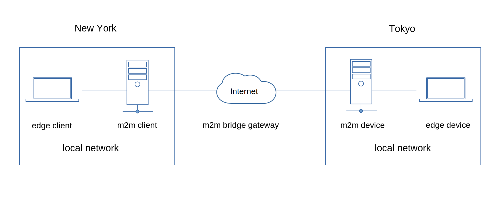

## M2M Bridge Gateway


In this example, an edge client will try to access an edge server from a local network on a different region. The communication path will change from a local network to a public internet traversing a new region and into the edge server local network.

All communication traffic from local network to public internet and vice versa are fully encrypted using TLS and a hybrid encryption - a combination of standard public and private encryption methods.  

<br>

### Edge Client

#### 1. Create an edge client project directory and install *m2m*.

```js
const m2m = require('m2m')

let user = new m2m.User()
let edge = new m2m.Edge()

user.connect(() => {
     let ec = new edge.client({port:8140, restart:true})

     let pl = {sensor:true, type:'temperature', value:24}

     ec.write('edge-data-source-1', pl, (data) => {
          console.log(data.toString())
     })

     ec.on('error', (err) => {
         console.log('error', err.message)
     })
})
```
#### 3. Start your device application.

```js
$ node device.js
```

### M2M Client
```js
const m2m = require('m2m')  

let client = new m2m.Client()
let edge = new m2m.Edge()

client.connect(() => {
    // m2m client accessing m2m device 300
    let device = client.accessDevice(300)
    
    edge.createServer(8140, (server) => {
         server.dataSource('edge-data-source-1', (tcp) => {
             if(tcp.payload){
                 device.write('m2m-bridge-1', tcp.payload )
                 tcp.send('ack rcvd data')
             }
         })
    }) 
})
```

### M2M Device
```js
const m2m = require('m2m')  

let device = new m2m.Device(300)
let edge = new m2m.Edge()

device.connect(() => {
    let ec = new edge.client({port:8150, restart:true})

    // m2m device/server data source
    device.dataSource('m2m-bridge-1', (ws) => {
        if(ws.payload){
            ec.write('edge-data-source-1', ws.payload)
        }
    })
})
```

### Edge Device
```js
const m2m = require('m2m')

let user = new m2m.User()
let edge = new m2m.Edge()

user.connect(() => {
     edge.createServer(8150,  (server) => {
          server.dataSource('edge-data-source-1', (tcp) => {
              if(tcp.payload){
                 console.log('edge-data-source-1 rcvd data', tcp.payload)
                 tcp.end() 
              }
          })
     })
})
```

#### 3. Start the edge device application.

```js
$ node device.js
```
You should get a similar result as shown below.
```js
edge-data-source-1 rcvd data {sensor:true, type:'temperature', value:24}


```


